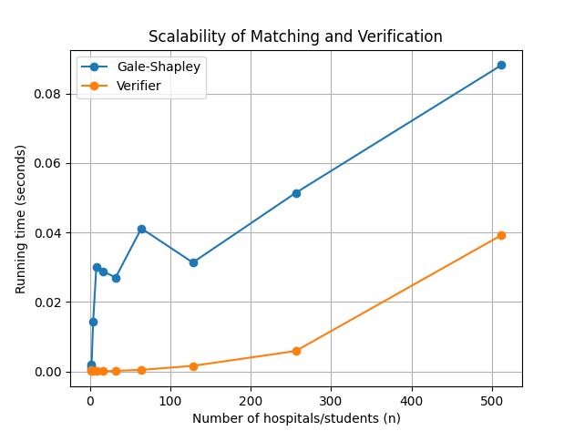

Om Vaddi (15302285)
Thomas Alvarado (65211333)

Matcher Instructions:
- Create an input file in the files folder.
- See assumptions section for file formatting.
- Run "python src/matcher.py".
- Enter the file path when prompted. ex: files/file1.txt.
- Read results.

Verifier Instructions:
- The verifier runs automatically after the matcher completes.
- Note: the verifier cannot be run independently because it requires the Gale_Shapley output.

Example Input (files/example.txt):
3
1 2 3
1 2 3
2 1 3
1 3 2
2 3 1
3 1 2

Example Output (files/example_output.txt):
1 1
2 2
3 3
VALID STABLE

Assumptions:
- Hospitals and students are named as positive integers starting from 1.
- For matcher.py the first input is the n, the number of hospitals and students there are. The next n lines are the hospital preference lists and the next n lines after that are the student preference lists. The output will be n lines each with two positive integers indicating a matched pair, the first integer being the hospital's name and the second being the student's name. 
- For scalability.py, run "python -m pip install matplotlib" if not already installed.
- To run scalability.py, run "python src/scalability.py". A pop-up window should appear with the graph.

Task C:

The trend that we noticed in this graph is that for the Gale-Shapley algorithm, the runtime fluctuates for small n values until it reached a certain n value between 100-150, which is implied to be n0. After this point, its graph is roughly linear, however, with greater n values, it should look quadratic. For the verifier, the graph showed to be quadratic. Overall, the graph shows that the Gale-Shapley algorithm has a higher runtime than the verifier due to larger constant factors.